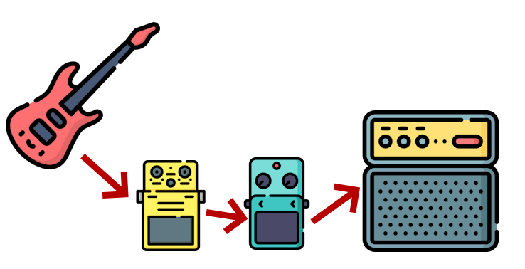
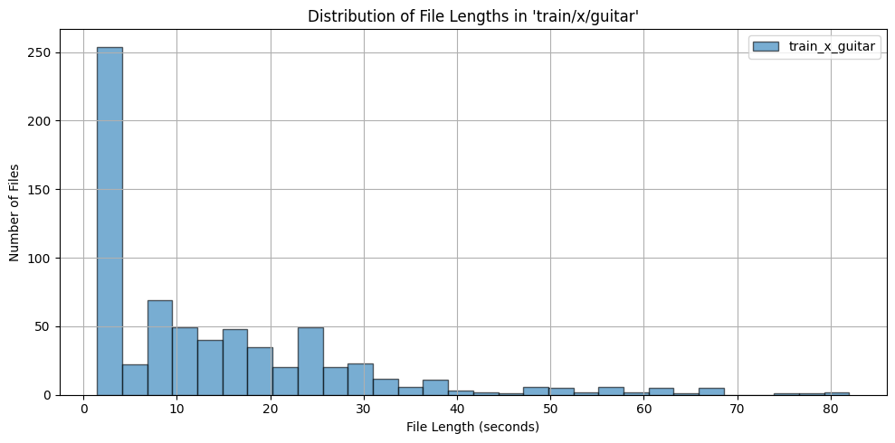
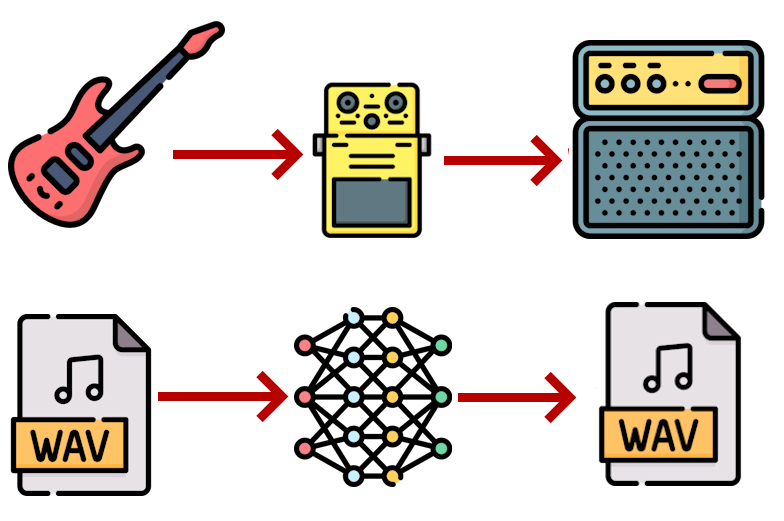
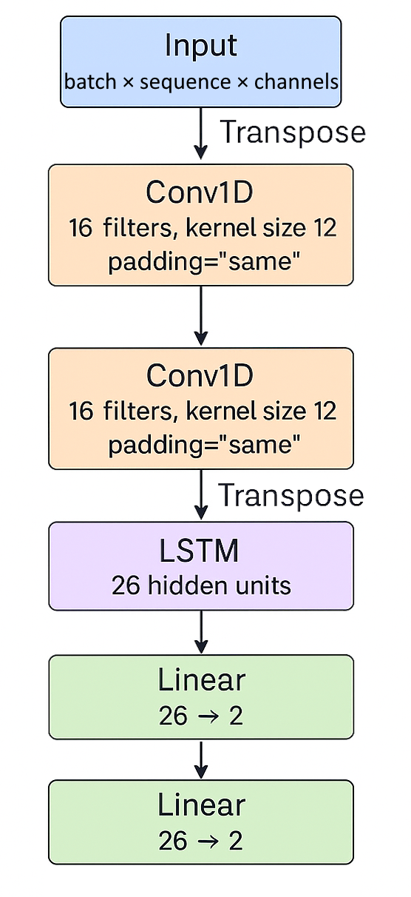
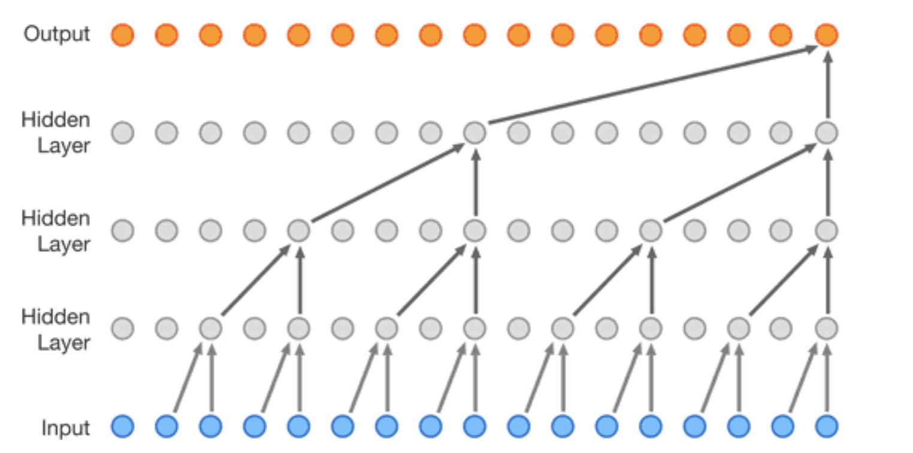
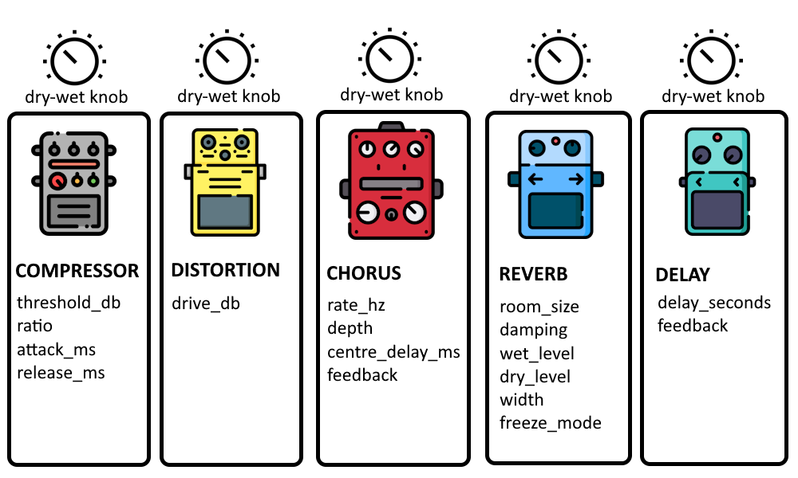

# Emulation of Guitar Effects Using Machine Learning

[Download Master's Thesis](docs/Masters.pdf)

## Introduction

The goal of this project is to learn the audio transformations introduced by effect pedals using machine learning models. The model should learn to emulate various types of transformations:

*   **Short** (distortion), < 10ms
*   **Long** (equalizer, flanger), < 1s
*   **Very long** (delay, reverb), > 1s



## Dataset

We used the **Musical Instruments Sound Dataset** by Soumen dra Prasad (KaggleHub).

*   **Train set**: 700 recordings of guitar, drums, and violin each, and 528 recordings of piano.
*   **Test set**: 80 recordings, 20 from each class.
*   Effects were applied via Spotify’s PedalBoard library.



## Approaches

We explored two main approaches: **Black Box** and **Gray Box**.

### Black Box

No assumptions are made about the internal structure of guitar pedals.

1.  **Fully Connected Network (FCN)**
    *   Works one sample at a time.
    *   Successfully learns only the simplest distortion effect.
    *   **Problem**: No memory, cannot rely on previous samples to model longer effects.

    

2.  **Long Short-Term Memory (LSTM)**
    *   Introduces memory.
    *   Captures a small part of the reverb tail but fails to emulate the complete effect.
    *   **Limitation**: Hardly parallelizable, slow training.

    

3.  **WaveNet**
    *   Introduces dilated convolutions.
    *   Results similar to LSTM but converges faster due to parallelization.
    *   **Limitation**: Limited receptive field.

    

4.  **Temporal Convolutional Networks (TCN)**
    *   More stable and easier to train than WaveNet.
    *   **Limitation**: Limited receptive field.

5.  **Structured State Space Models (Mamba)**
    *   Differentiable realization of an infinite impulse response (IIR) system.
    *   Parallelizable with theoretically unlimited receptive field.
    *   Designed for efficiency and ease of integration in audio tasks.

### Gray Box

Assumes some internal structure but relies on optimization methods to fill out unknown parameters. We define an individual as a chain of 5 pedals.

1.  **Genetic Algorithm**
    *   **Initialize**: 400 random individuals.
    *   **Selection**: Favoring individuals with lower MSE.
    *   **Crossover**: Child inherits effects from parents.
    *   **Mutation**: Modifies parameters or dry/wet mix.

    

2.  **Gradient-Based Optimization (DASP)**
    *   Uses a library with differentiable effects.
    *   Faster convergence but less expressive than the GA approach due to fewer available effects.

## Results

*   **Black-box methods** generally outperform gray-box methods.
*   **SSSM (Mamba)** offers both fast training and unlimited receptive field, beating other black-box networks.
*   Modeling LFO-based effects (phaser, flanger) is harder than other effects.
*   Transformer architectures would work well but are computationally expensive.

## Project Structure

```
.
├── data/               # Dataset directory (train/test split)
├── docs/               # Documentation and assets
│   └── assets/         # Images for README/Thesis
├── gen/                # Generated files
├── models/             # Saved model checkpoints
├── plugins/            # VST3 plugins
├── research/           # Research notes and papers
├── results/            # Experiment results
├── src/                # Source code
│   ├── datasets/       # Data loading and processing
│   ├── gan/            # GAN implementation
│   ├── gray_box_models/# Genetic and DASP implementations
│   ├── helper/         # Helper functions (loss, training, etc.)
│   └── models/         # Black-box model implementations (LSTM, Mamba, etc.)
├── README.md
└── requirements.txt
```

## Setup

```bash
python3 -m venv venv
source venv/bin/activate # linux
# ./venv/Scripts/activate.bat # windows
pip install -r requirements.txt
```

---
*Luka Ivanković - University of Zagreb, Faculty of Electrical Engineering and Computing*


